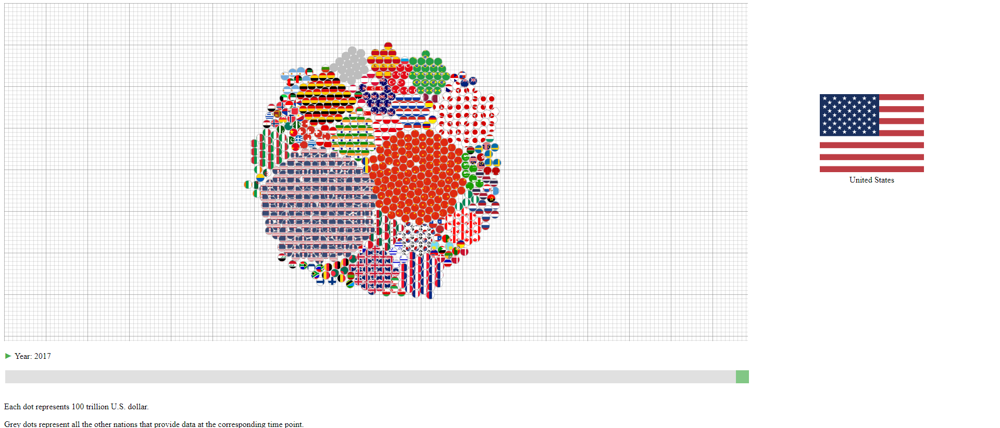
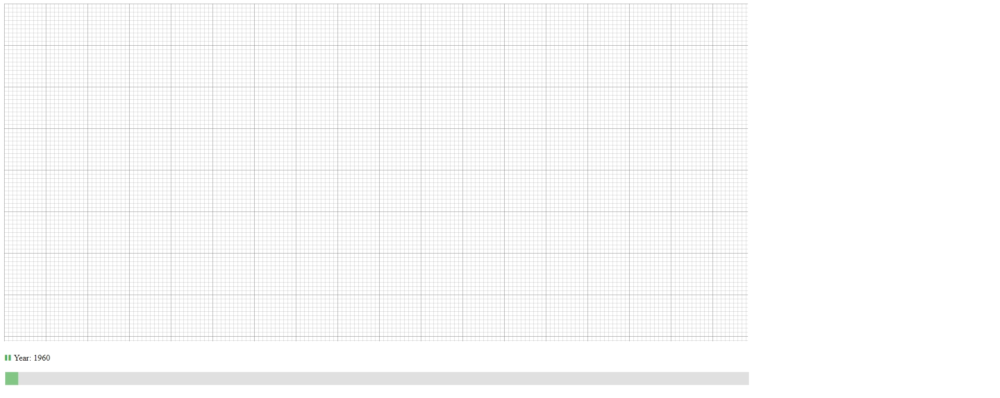
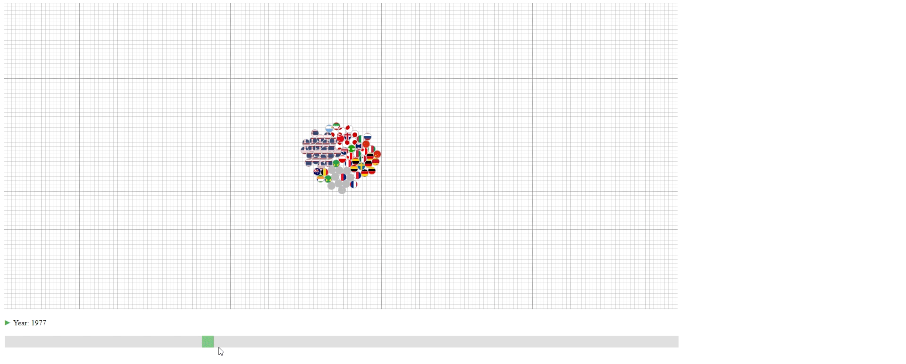
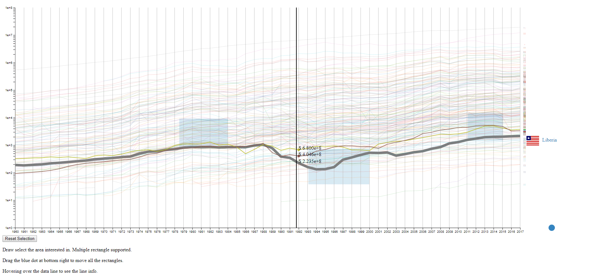
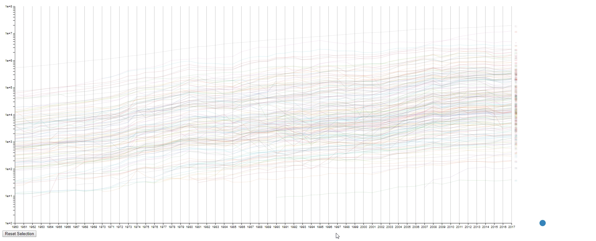
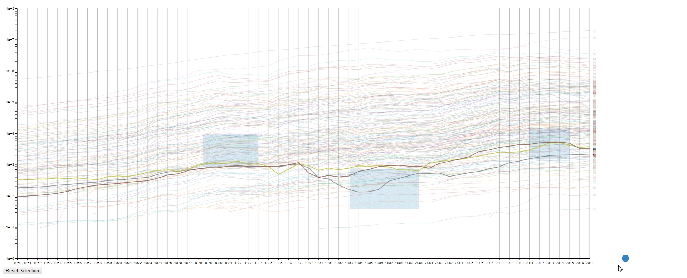
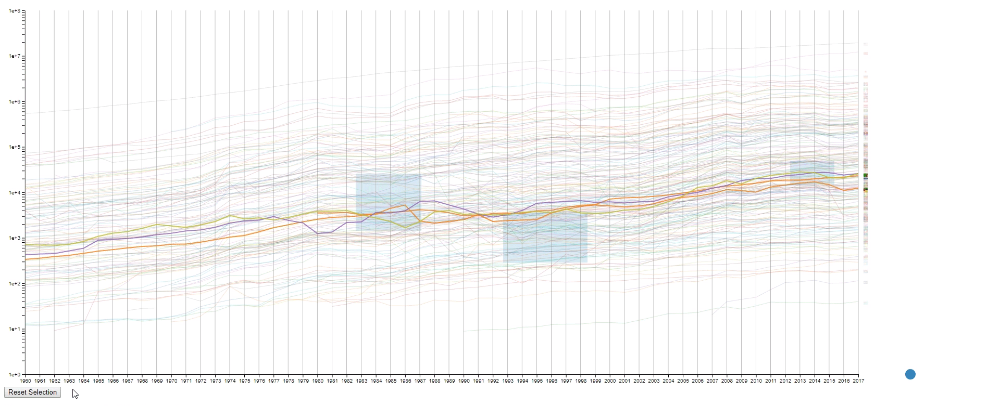
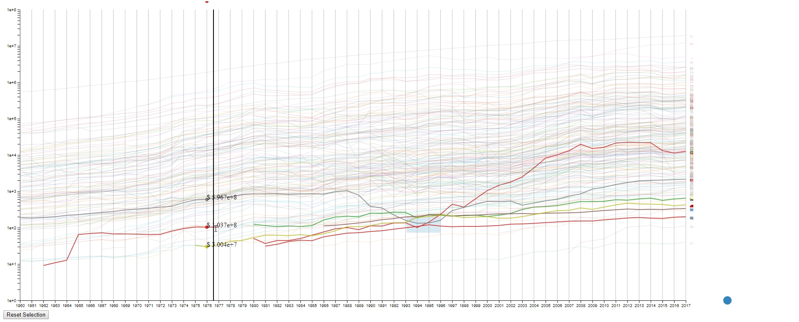
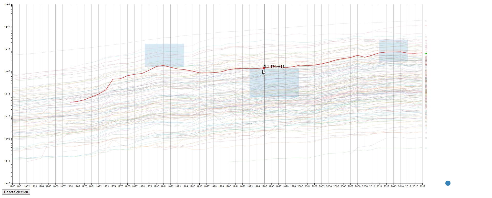

# CS765 DC3 designs

## Dataset

I have found a dataset online describing the GDP of different nations since 1960. <https://data.worldbank.org/indicator/NY.GDP.MKTP.CD?end=2017&start=1960&view=chart> This dataset involve all the countries in the world (268) and covers a period over 70 years. So, this dataset fits into the defined case:

1. The number of "lines" (N) is the number of countries (268).
2. The number of samples of each line (M) is 77. 
3. The range of the values is between $8 \times 10^7$ and $8 \times 10^{13}$.

I used this dataset for both of my designs. But the designs themselves can also be implemented for other datasets. 

## Design

### Design 1

[Go to Design 1](design1/)

The first design encodes the year into data change during animation. So, it should work on the similar type of datasets as long the samples (M) is the time.

#### Encoding

1. The countries (N) are represented by their national flags.
2. The years (M) are represented by the slider at the bottom and shown as the change of the graph.
3. The GDPs (values) are represented by the number of circles in the graph with each circle representing 100 trillion U.S. dollar. The countries with less than 50 trillion U.S. dollar GDP are encoded together in the grey circles.

#### Animation & Interation

1. The design has an animation that starts automatically to show the change of GDPs over the years. This animation can be paused and continued using the button at the bottom left.

  

2. The user can drag the slider at the bottom to slide to the desired year.

  

3. Hovering over the circle to see the name of the country that a circle belongs to.

  

#### Design Critique

This design has three purposes: 

1. To show the approximate value (GDP) of each line (Country). 
2. To show the lines (countries) that have the top values (GDPs) among all the lines.
3. To show the portion of each line (country) in the sum of values (GDPs).

However, the design also has some limitations:

1. The value is not accurate with an accuracy of around  100 trillion U.S. dollar.
2. If one wishes to know the values (GDPs) of lines (countries) with small values (GDPs), it's not possible.
3. It's not easy to compare the values (GDPs) of a line (country) between two samples (years) due to the animation effect.
4. It's not easy to compare the values (GDPs) between to lines (countries) that have similar values (GDPs) unless counting the exact number of circles.
5. The animation of a sample (year) takes a long time to finish when the values (GDPs) are large, and it's really computational ineffective to build the visual result.

#### Compare against Baseline

##### Against Spaghetti Plot & Small Multiples

This design is much better at showing the portion of different lines (countries) than the spaghetti plot or small multiples. And it scales well against large line (country) numbers, with the tradeoff of aggregating the lines (countries) with small numbers. However, this design is not good at comparing the values (GDPs) between to lines (countries) that have similar values (GDPs) or the values (GDPs) of a line (country) between two samples (years), which can be better solved using small multiples.

##### Against Multiple Heatmaps

This design scales better against large line (country) numbers. And it's more accurate than the multiple heatmaps (with the assumption of "area" being a better encoding than "color saturation" for rational number). But it is relatively harder to read the actual number for lines (countries) with large values (GDPs) as the user has to count the number of circles.

### Design 2

[Go to Design 2](design2/)

The second design is an enhanced spaghetti plot with a few interactions enabled. The purpose of this design is to help to identify lines with similar values or values changes. This design should work on other datasets with no problem.

#### Encoding

1. The countries (N) are represented by the color of lines and the national flags at the right of the plot. The flag can be seen clearly by hovering over the line.
2. The years (M) are encoded on the x-axis as common spaghetti plot.
3. The GDPS (values) are encoded on the y-axis as common spaghetti plot.

#### Interation

1. Draw rectangles using the mouse in the canvas area to select lines. The user may draw more than one rectangle at a time, and only the lines that fit into all the rectangles will be highlighted.

  

2. Move all the rectangles by dragging the blue dot at the bottom right.

  

3. Clear all the rectangles by clicking the button at the bottom left.

  

4. Move the mouse across the canvas to see the GDPs of selected countries at the given year.

  

5. Hover the mouse over a selected line to see the details of the country that it belongs to.

  

#### Design Critique

This design has four purposes: 

1. To find lines (countries) with similar values (GDPs) at a sample (year) range. This is achieved by using rectangles to select lines.
2. To find lines (countries) with the desired change pattern over samples (years). This is achieved by drawing multiple rectangles.
3. To find lines (countries) with similar change patterns over samples (years). This is achieved by moving rectangles using the blue dot.
4. To get a relatively accurate value (GDP) of a line (country) at a sample point (year).

However, the design also has some limitations:

1. It's a spaghetti plot still, so it looks messy at the first impression.
2. It's hard to compare if too many lines (countries) are selected. In this case, it's still a spaghetti plot.
3. It's impossible to select two lines (countries) that are far away without selecting the lines (countries) in between at the same time.
4. The line (country) encoding is not efficient as the user are required to hover to know the info of the selected line (country). 
5. The design runs leggy at my computer, and I have no idea why it happens as I designed my code to be efficient during the interactions. It's probably due to the inefficiency of javascript.

#### Compare against Baseline

##### Against Spaghetti Plot

This design is much better in every way than the origin spaghetti plot, as it's an enhancement of the spaghetti plot. The benefits are just the purpose I mentioned above.

##### Against Small Multiples & Multiple Heatmaps

This design works better to compare the values (GDPs) of two lines (countries) nearby. And this design also adds the benefit of identifying the lines (countries) with the desired value or pattern. But the user cannot simply select a line (country) and see its data (GDP), which can be done by small multiples and multiple heatmaps.

## Reference

1. D3: For building the visualization. <https://github.com/d3/d3>
2. GDP (current US$) - THE WORLD BANK: The dataset used to design the visualization. <https://data.worldbank.org/indicator/NY.GDP.MKTP.CD?end=2017&start=1960&view=chart>
3. flag-icon-css: For the svg flags. <https://github.com/lipis/flag-icon-css>
4. country-iso-3-to-2: For translating the Alpha 3 country code to Alpha 2 country code. <https://github.com/vtex/country-iso-3-to-2>
5. killercup/pandoc.css: For the index page style. <https://gist.github.com/killercup/5917178>
